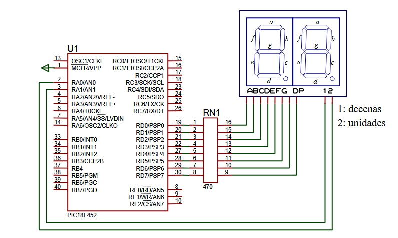
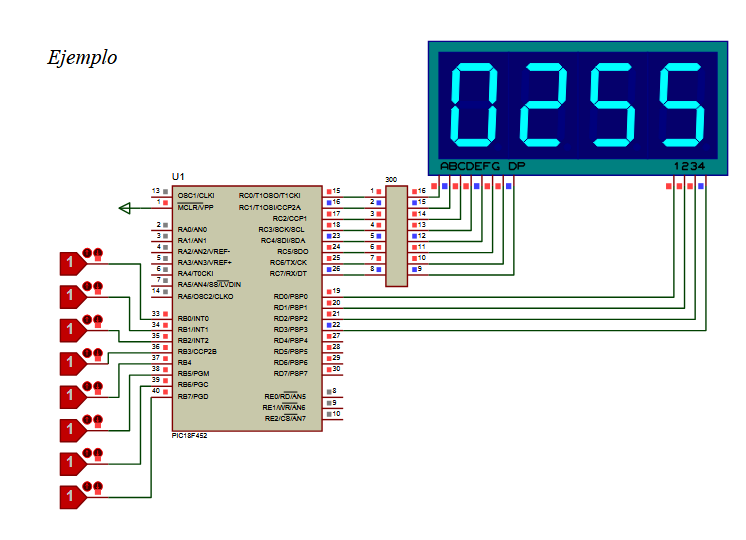

# PRACTICA 2, DISPLAYS DE 7 SEGMENTOS

Hay 2 apartados:

- Apartado a: implementacion de un segundero.
- Apartado b: implementacion de un conversor de binario a base 10.

### Apartado a
Para mostrar las unidades y decenas hacemos uso de los puertos PORTA.B0 y PORTA.B1, donde un 0 habilita una mitad, y el 1 la deshabilita. 

Problema -> el display SOLO puede mostrar informacion por UNA de las mitades de cada vez, es decir, si por el puerto de habilitacion de las decenas esta recibiendo un 0, por el otro no puede recibirlo.

Para arreglarlo, debemos ir intercalando la habilitacion del segmento, es decir habria una especie de parpadeo muy rapido para dar sensacion de que dicho parpadeo no existe.

- Puerto D -> envia los valores a representar.
- Puerto A -> se encargan de activar/habilitar el display.

```c
// Fragmento del ciclo de refresco (Multiplexado)
for(i=0; i<20; i++){
    PORTA.B1 = 0; PORTA.B0 = 1; // Enciende Unidades
    delay_ms(10);
    PORTA.B0 = 0; PORTA.B1 = 1; // Enciende Decenas
    delay_ms(10);
}
```
***
### Apartado b

Ahora se trata de que el valor en binario que entra por PORTB, se convierte en decimal en el display a través de PORTC.

Se lleva a cabo descomponiendo el binario en unidades, decenas, centenas y millares, para asi poder representarlo en el display cuadruple usando la misma tecnica del parpadeo que antes.

Igual que antes si por PORTD.Bx entra un 0 se enciende el display, si entra 1 se apaga. (B0 para millares, B1 para centenas, B2 para decenas y B3 para unidades).

```c
//Ejemplo de como se extrae el valor de la unidades
PORTC = numeros[valor%10];
PORTD.B3 = 0;
delay_ms(5);
PORTD.B3 = 1;
```

### Diagramas en proteus


- Apartdo a: PIC18F452, 7SEG-MPX2-CC-BLUE, RX8


- Apartado b: PIC18F452, 7SEG-MPX4-CC-BLUE, RX8, LOGICSTATE