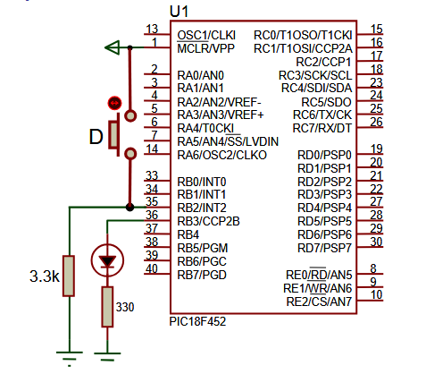
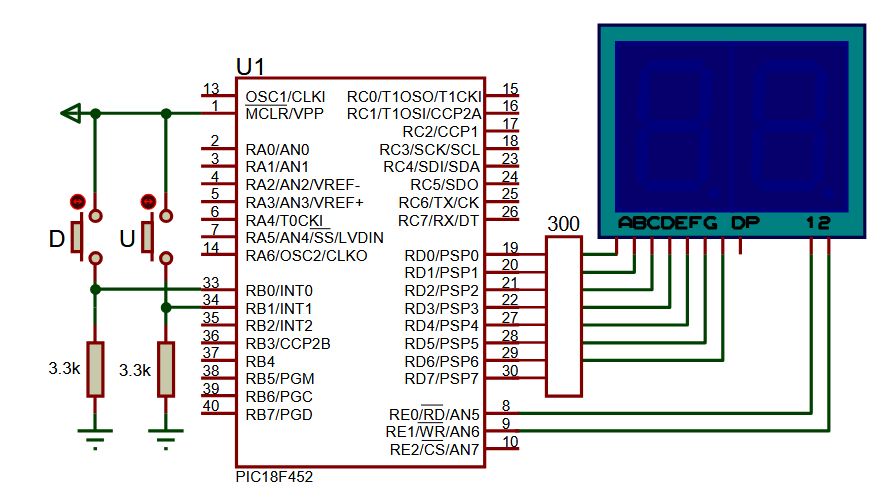

# PRACTICA 3, INTERRUPCIONES INTx

Hay 3 apartados:

- Apartado a: encendido de un led usando polling.
- Apartado b: encendido de un led con interrupcion.
- Apartado c: contador con display de 7 segmentos.

### Apartado a
En este caso tenemos que observar cada 100ms el PORTB.B2 (es donde esta enchufado el boton), y si en ese tiempo entra un 1 por ese puerto (alguien lo ha pulsado), el led se tiene que encender.

NOTA: trabajo con una variable estado_led, pero realmente no haría falta pq puedo acceder directamente al puerto B3 y dar valores.

### Apartado b
Exactamente igual, solo que aqui no puedo hacer polling, la logica es exacatamente la misma, solo que ahora me "despreocupo". Cada vez que en un flanco de subida se detecte que el valor ha cambiado, por PORTB.B3 saldría un uno. Aqui importante ya no uso del estado_led.

### Apartado c
Aqui manejamos 2 interrupciones, la de RB0 que es el boton que resta al contador, y la de RB1, que suma. Importante destacar 2 cosas:

a) Solo se pone un GIE ya que es el interruptor que activa TODAS las interrupciones de golpe. Ahora, si hay que poner un INTxIE que active cada una por separado (como analogía sería el interruptor de la luz que hay en cada habitacion).

b) Las interrupciones de RB0 estan en la libreria INTCON, no INTCON3 (temas de compatibilidad con chips viejos etc...).

En este apartado a diferencia del b, si hay que meter codigo dentro del while, ya que ahi es donde hay que manejar la representación de los numeros en el display. 

```c
EN void interrupt ME LIMITO A MANEJAR LA INTERRUPCION, PERO EL DISPLAY EN SI LO PONGO SEPARADO
```

### Diagramas en proteus

- Apartados a y b: PIC18F452, RES, LED-BLUE, BUTTON


-Apartado c: PIC18F452, 7-SEG-MPX2-CC-BLUE, RES, BUTTON, RX8