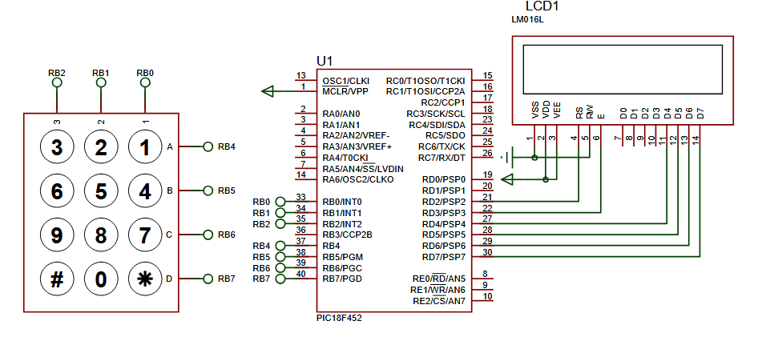
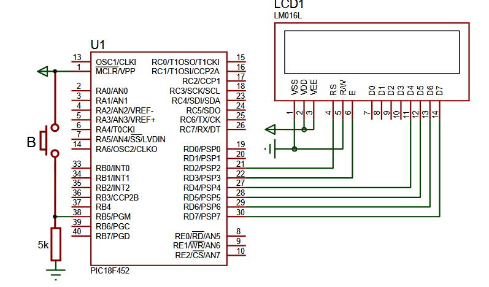
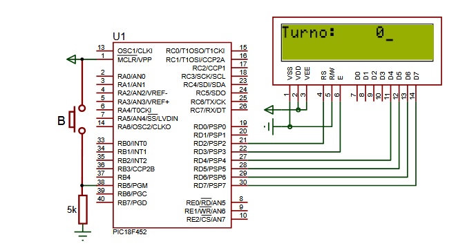
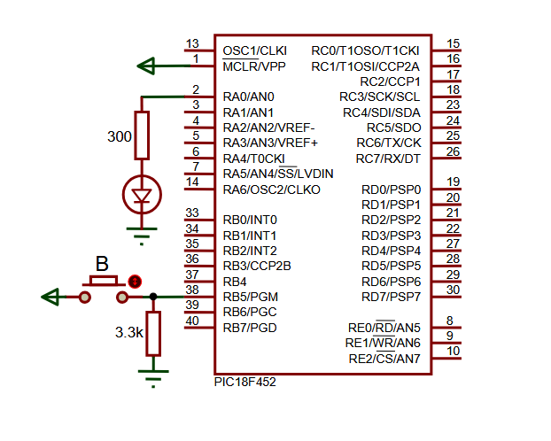
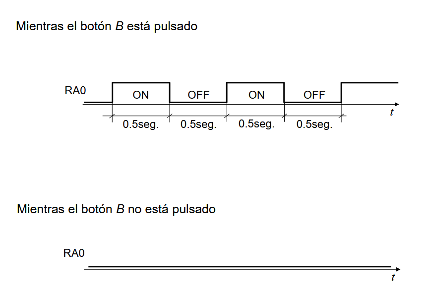

# PRACTICA 4: INTERRUPCIONES RB Y LCD

Hay 3/4 apartados:

- Apartado a: mostrar por el lcd lo que voy insertando por el teclado.
- Apartado b y c: contador.
- Apartado d: parpadeo del led.

### Apartado a
Apartado sencillo, lo unico que hay que tener en cuenta es el uso de un fichero .h que contiene la funcion tecla(), que permite conocer la tecla que se esta pulsando en un determinado momento. 

Destacar que para poder hacer uso de las funciones Lcd, hay que habilitar la libreria en el compilador, y declarar una serie de variables globales (los sbit), que me permiten trabajar con los puertos del lcd.

### Apartados b y c
Estos 2 son realmente el mismo apartado pero con la diferencia de que en el c hay que añadir una frase a mayores antes del contador. 

Cosas a destacar:
- Para empezar, pq no hago uso de Lcd_Out_CP para mostrar los numeros? CP significa current position, es decir que en la posicion actual del cursor va a mostrar el numerito. Problema? El numero es como si se actualizase continuamente (esta dentro del bucle infinito), por lo que la posicion actual esta cambiando todo el rato. Resultado? Todo el lcd muestra el contador. (Eso no pasa con el t)

- Segundo, estoy usando un if al principio del while? Si no lo pongo todo lo que esta dentro se está ejecutando siempre, esto hace que el cursor no se esté quieto parpadeando al final del todo, estaria bailando todo el rato de posicion.

### Apartado d
En este se nos pide que el led este apagado SIEMPRE que el boton este sin pulsar, y que este parpadeando con un ciclo de 500ms, mientras está pulsado. El codigo a priori es también (como diría vilares) trivial, pero vamos a pararnos en un par de cosillas del codigo:

En el void interrupt, trabajamos con una variable llamada estado_led, que es un flag que nos va a decir si el led esta o no pulsado. Importante saber que si yo tengo el boton pulsado y lo suelto cuando esta encendido el led, este DEBE APAGARSE.

```c
void interrupt(){
     if(PORTB.B5 == 1){
           estado_led = 1;
     }else{
           estado_led = 0;
           PORTA.B0 = 0;
     }
     x = PORTB;
     INTCON.RBIF = 0;
}
```

Esto que en un principio es sencillo, ya que podemos pensar que con lo que tenemos en el interrupt() nos llega, no es asi.

Si en el void() nos limitamos a poner lo siguiente con el interrupt() anterior:

```c
while(1){
    if(estado_led == 1){
        PORTA.B0 = 1;
        delay_ms(500);
        PORTA.B0 = 0;
        delay_ms(500);
    }else{
        PORTA.B0 = 0;
    }
}
```
lo que nos va a pasar es que en el momento en el que yo suelto el boton estando el led encendido, efectivamente se va a apagar, PERO si lo vuelvo a pulsar, el led tardaria un poco en arrancar. Por que? Pues porque el delay_ms(500) sigue ejecutandose. 

Como arreglamos ese problema? Con lo siguiente:
```c
while(1){
    unsigned short i;
    if(estado_led == 1){
        PORTA.B0 = 1;
        for(i=0; i<50 && estado_led == 1; i++){
            delay_ms(10);
        }
        PORTA.B0 = 0;
        for(i=0; i<50 && estado_led == 1; i++){
            delay_ms(10);
        }
    }else{
        PORTA.B0 = 0;
    }
}
```
Con este codigo me aseguro que solamente se ejecute el delay_ms(10) 50 veces (que equivaldria al delay de 500ms) SOLAMENTE si el estado_led==1, es decir si el boton está pulsado.

### Diagramas en proteus


- Apartado a: PIC18F452, LM016L, KEYPAD-PHONE




-Apartados b y c: PIC18F452, LM016L, BUTTON, RX8



-Apartado d: PIC18F452, LM016L, BUTTON, RX8