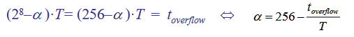
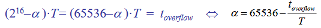
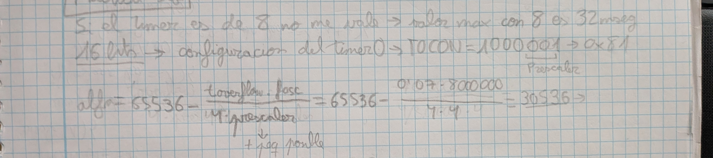
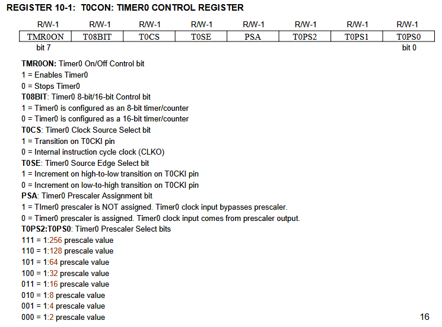

# PRACTICA 5: TIMERS

3 apartados: 
- Apartado a: de calcular el tiempo maximo que puedo temporizar con el timer 0, siendo este de 8 y 16 bits. Lo hacemos primero en el caso de que el micro tenga una frecuencia de 8MHz, y con 20MHz.
- Apartado b: programa sencillo con el que representamos los estados por los que pasa un motor.
- Apartado c: con el timer tenemos que hacer que los led se enciendan durante x segundos.

### Apartado a
Simplemente hay que aplicar la siguiente formula para sacar toverflow:




NOTA IMPORTANTE: el timer cuenta hasta un valor maximo, incrementando el valor de partida de 1 en 1. Al llegar al maximo valor posible (Ej con 8 bits: 1111 1111), si yo le sumo 1 el valor deberia ser 1 0000 0000, pero no puede representar ese valor por el num de bits. Se produciría overflow==interrupcion.

Los resultados son:
a) Con 8MHz y 8 bits: 0.032768seg
b) Con 8MHz y 16 bits: 8.3886 seg
c) Con 20MHz y 8 bits: 0.013107
d) Con 20MHz y 16 bits: 3.3554 seg

Pq estos resultados??? El numero de repeticiones es mayor por el aumento de la frecuencia del micro, por lo tanto iría mas rapido/tarda menos en llegar al final.

### Apartado b
En este tenemos que implementar un sistema que segun el valor de la entrada PORTA.B0 y una serie de variables, cambien el estado del motor. Cada 70ms tenemos que ir comprobando el valor de la entrada y las variables. 

OJO IMPORTANTE: NO SE PUEDE USAR LAS FUNCIONES Delay_ms(). Esto ya no solo porque estamos trabajando con el timer propio del micro, es recomendable trabajar directamente con ellos ya que las funciones delay consumen memoria.

Los estados son los siguientes:
```c
 si Q = 0 y a = 0: se deja Q = 0 y se deja m = m
 si Q = 0 y a = 1: se pone Q = 1 y se deja m = m
 si Q = 1 y a = 1: se dejan Q = 1 y m = m
 si Q = 1 y a = 0: se pone Q = 2 y se cambia el valor de m
 si Q = 2 y a = x: se pone Q = 0 y m = m

 Q es una variable de nuestro codigo y a es PORTA.B0
```
CALCULO DEL TIMER
Es de 8 o 16 bits??? Para responder a esto debemos mirar el apartado a. Con 8 bits el maximo que podemos contar es de 32mseg. No me llegaría, tendría que irme al de 16.

Otra cosa que hay que conocer es el preescaler (divisor de frecuencias), que es el que me permite dividir la frecuencia del micro. Esto me sirve para poder alargar el tiempo que necesito para que el timer desborde. Como se cual me conviene en cada caso?? Pues hay que ir probando con cada posible valor (2,4,8,16,32,64,128 o 256). Tengo que aplicarlo en la formula de antes para conocer alfa (el valor con el que el timer empieza a contar), e ir probando con cada posible valor hasta encontrar el primero que me de un valor positivo lo mas bajo.



Conocido alfa, ahora lo ultimo que queda es guardar el valor. Para ello como usamos un timer de 16 bits, el valor se guarda entre 2 registros TMR0H y TMR0L. Para poder asignarlo bien, en los apuntes se recomienda hacerlo asi:
```c
 unsigned int alfa = 30536;
 TMR0H = (alfa>>8);
 TMR0L = alfa;
```
Otra cosa importante es la configuracion de T0CON. Este es el registro que nos permite controlar el timer. En nuestro caso es 10000001 == 0x81.



### Apartado c
Aqui hay trabajamos con 2 botones y 2 leds, cuando se pulsa el boton A, L1 se enciende durante 3seg, y al pulsar B L2 se enciende durante 4seg. Importante también que se nos dice que si un led esta encendido, e intento encender el otro no puede pasar nada.

Necesitamos aqui 2 valores de alfa, uno para el boton A y otro para el B. Igual que antes, lo calculamos con las formulas. Los resultados son:
 - 3seg: alfa=18661, T0CON=0x86 con prescaler 128 (110)
 - 4 seg: alfa=3036, T0CON=0x86 con prescaler 128 (110)

Si vamos al codigo, se puede ver que en T0CON estoy poniendo 0x06. Esto es pq el bit TMR0ON del registro T0CON esta a 0. Esto lo hago pq solo me interesa temporizar desde el momento en el que le doy al boton (no tendria sentido estar temporizando todo el rato xd).

### Diagramas en proteus

[!Apartado b](./img/b2.png)
[!Apartado b](./img/b3.png)
- Apartado b: PIC18F452, DIODE-SC, FMM619, MOTOR, RES, LOGICTOGGLE, CELL

[!Apartado c](./img/c.png)
- Apartado c: PIC18F452, Button, Led-green, Led-red, Res, Counter timer

*El counter timer se saca en el menu 'Virtual instruments mode'*
