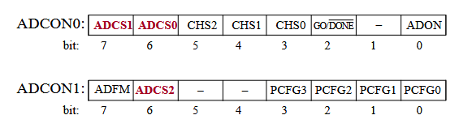
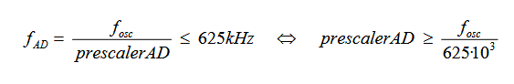
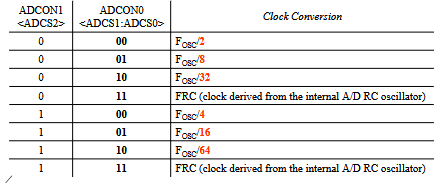
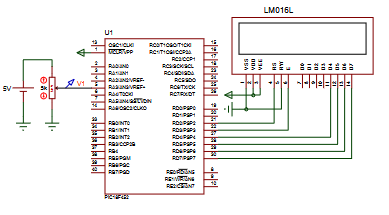
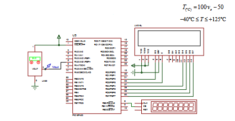
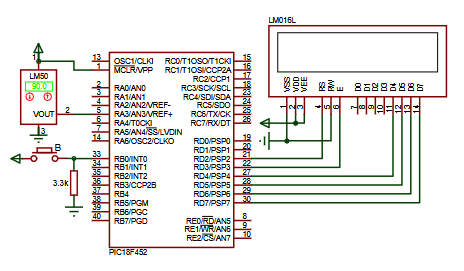
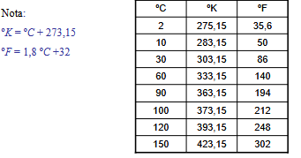

# PRACTICA 6: CONVERSIONES AD

- Apartado a: creacion de un voltímetro.
- Apartado b: creacion de un termometro en grados celsius.
- Apartado c: creacion de un termometro que permite mostrar valores en celsius, kelvin o farenheit.

### Apartado a
En este apartado hay que hacer un voltimetro usando el convertidor AD del micro. Aqui si podemos usar la funcion delay_ms().

Para poder hacer uso del convertidor AD hay que configurar los registros ADCON0 y ADCON1.

Las muestras de la señal continua/analogica se toman en la funcion void interrupt.



IMPORTANTE: Para configurar los bits ADCSx de los registros ADCON0 y ADCON1. Los bits ADCSx nos sirven para indicarle el valor del prescaler al conversor AD.



En funcion de ese resultado, elegimos un valor del prescaler (en este caso el mayor valor mas cercano al del resltado. Ej: si la relacion es de 12.8, el prescaler que elegimos es de 16).



### Apartado b
Crear un termometro. En este caso no se puede usar las funciones delay, por lo que ademas de configurar las interrupciones del AD, ahora también hay que configurar la del timer0 (T0CON, alfa...).

Una cosa que hay que tener en cuenta aqui es que el periodo de muestreo es de 1.2 seg, es decir el timer tiene que contar esos 1.2 segundos, y al llegar tomar una muestra.

```c
if(INTCON.TMR0IF == 1){
    TMR0H = (alfa>>8);
    TMR0L = alfa;
    PORTE.B0 = ~PORTE.B0;
    ADCON0.GO = 1;
    INTCON.TMR0IF = 0;
}
```
A diferencia del ejercicio anterior, aqui el conversor AD tiene que arrancar (ADCON0.GO=1) al pasar ese tiempo.

De donde sale esto? 
```c
temp = 100*(((float)valor)*(5.0/1023.0))-50;
```
 El 100 y el -50 viene dado en el enunciado. Lo demas sale de hacer una regla de tres:
 ```c
5V - 1023
valor - x
 ```

### Apartado c
Hay que modificar el ejercicio anterior, para que ahora pueda mostrar temperaturas en diferentes magnitudes cada vez que se pulsa el boton.

### Diagramas en proteus

- Apartado A: PIC18F452, POT-HG, CELL, LM016L


- Apartado B: PIC18F452, LM50, LM016L



- Apartado C: PIC18F452, LM35, LM016L, BUTTON