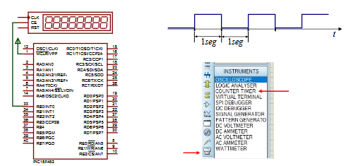
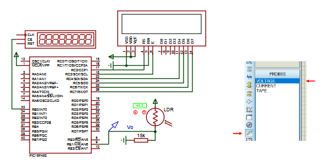
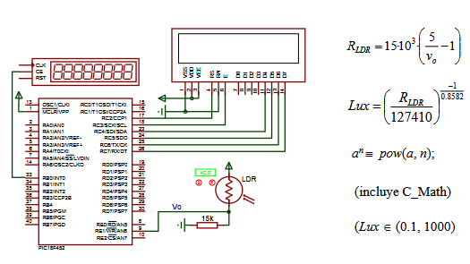
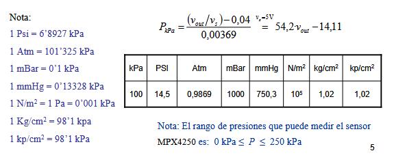
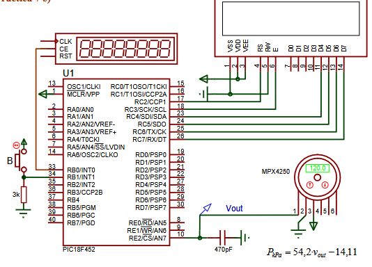

# PRACTICA 7: CONVERSIONES AD

- Apartado a: calculos.
- Apartado b: generar una señal binaria, periodica y continua en tiempo.
- Apartado c: tomar y mostrar valores de muestras.
- Apartado d: crear un luxometro
- Apartado e: crear un medidor de presiones.

NOTA: EN ESTA PRACTICA NO SE PUEDEN USAR LAS FUNCIONES DE DELAY

### Apartado a
Hay que calcular el valor de T0CON y el valor desde el que el timer0 tiene que empezar a contar (alfa). Se tiene que temporizar cada segundo.

### Apartado b
En este apartado por RB0 tiene que salir una señal binaria periodica, continua en el tiempo. El periodo es de 2 segundos. 

Evidentemente hay que configurar la interrupcion AD.

### Apartado c
Cada segundo, el micro debe tomar una muestra de Vo, que entra por RE1. Igual que en la practica anterior ADCON0.GO se tiene que poner a 1 en el momento en el que se produzca la interrupción del timer0.

### Apartado d
Igual que el apartado anterior, cambia en el while que el valor de la tension ya no lo podemos usar directamente:
```c
tension = ((float)valor)*(5.0/1023.0);
Rldr = 15e3*((5/tension)-1);
lux = pow((Rldr/127410.0), (-1/0.8582));
```
Rldr es la resistencia electrica de la fotoresistencia. El valor resultado esta en Ohms. Basicamente la formula obtiene el valor del ldr basandose en el voltaje (a mas luz la resistencia baja, a menos luz la resistencia sube)

Lux es el valor en voltaje. Esos numeros son constantes que dependen del aparato.

### Apartado e
Medidor de presiones. Aqui la frecuencia de muestreo es de 0.5Hz. Por defecto la presion se debe mostrar en kPa, y cada vez que se pulsa el boton, se debe cambiar las unidades (kPa, PSI, Atm, mBar, mmHg, N/m^2, kg/cm^2, kp/cm^2).

Obviamente hay que usar (además de las interrupciones del AD y del timer), una interrupcion para el boton.

### Diagramas en proteus


- Apartado B: PIC18F452, CounterTimer


- Apartado C: PIC18F452, RES, LM016L, LDR, CounterTimer


- Apartado D: PIC18F452, RES, LM016L, LDR, CounterTimer




- Apartado E: PIC18F452, MPX4250, RES, Button, CAP, LM016L